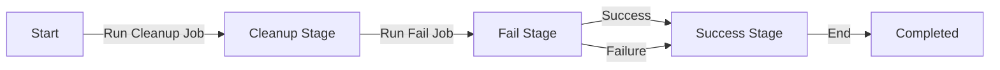

# Observability CI with GitLab and Ansible

## Overview

This project sets up a simple Observability CI/CD pipeline using GitLab CI. The pipeline triggers an Ansible playbook with different stages as defined in the `.gitlab-ci.yml`. This automation helps in managing infrastructure with well-defined stages, ensuring observability, and handling failures gracefully.

The pipeline consists of three key stages:

1. **Cleanup Stage**: Removes temporary files and prepares the environment.
2. **Fail Stage**: Runs an Ansible playbook after a delay and allows failure.
3. **Success Stage**: Ensures the playbook runs successfully after the failure stage.

Below is the flowchart representation of the pipeline using Mermaid:



## Setup Instructions

To set up the environment, follow these steps:

1. **Modify the variable files**

   - Rename `templates_variables` to `variables`:

     ```sh
     mv templates_variables variables
     ```

   - Update the values inside `variables` to fit your environment.

## Manually Running Ansible on Local Machine

If you need to manually execute the Ansible playbook, follow these steps:

1. **Ensure dependencies are installed**

   ```sh
   chmod +x setup.sh
   ./setup.sh
   ```

   This script will initialize necessary dependencies and set up the virtual environment.

2. **Source the variables file**

   ```sh
   source ./variables
   ```

3. **Run the Ansible playbook**

   ```sh
   ansible-playbook playbook.yml
   ```

This ensures that the playbook runs with the necessary environment and configuration.

## Steps to Add This Project to an Empty GitLab Repository

Follow these steps to set up this project in a new GitLab repository:

1. **Clone this repository locally**

   ```sh
   git clone <repository-url>
   cd <repository-name>
   ```

2. **Modify the variable file**
   - Rename `templates_variables` to `variables`:

     ```sh
     mv templates_variables variables
     ```

   - Edit `variables` and set the appropriate values.

3. **Change the Git remote origin to your GitLab repository**

   ```sh
   git remote set-url origin <your-gitlab-repo-url>
   ```

4. **Commit and push the changes**

   ```sh
   git add .
   git commit -m "Initial commit - Observability CI setup"
   git push -u origin main
   ```

5. **Verify in GitLab**
   - Go to your GitLab repository.
   - Check if the `.gitlab-ci.yml` file is correctly detected.
   - Monitor the pipeline in the GitLab CI/CD section.